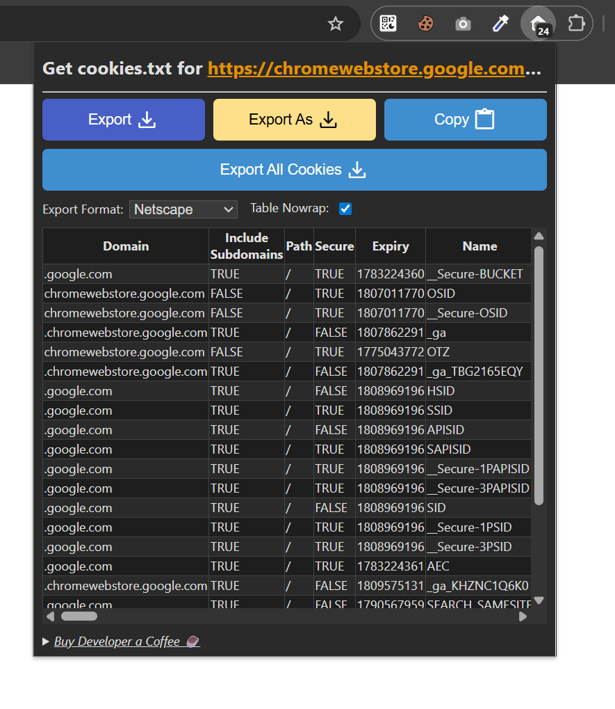
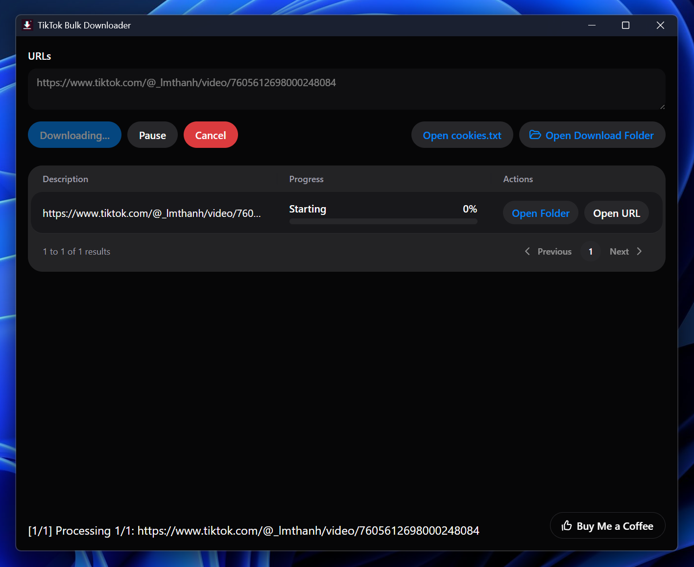

# TikTok Bulk Downloader

[**Download for Windows**](https://github.com/The-Senile-Developers/TikTok-Bulk-Downloader/releases/download/v0.0.4/TikTok.Bulk.Downloader_0.0.4_x64-setup.exe) 🚀

**TikTok Bulk Downloader** is a powerful tool developed by **The Senile Developers** that allows you to download multiple TikTok videos simultaneously at blazing speed. This software offers two convenient downloading modes:

1. **Download from Channel Link**:
   - Example: `https://www.tiktok.com/@{unique_id}`
2. **Download from Single Video Link**:
   - Example: `https://www.tiktok.com/@{unique_id}/video/{video_id}`

## Key Features

- **Bulk Download**: Supports downloading multiple videos at once, eliminating the need for repetitive processes.
- **Easy Management**: User-friendly interface for efficient management of your downloaded videos.
- **High Speed**: Take advantage of fast download speeds to save time and bandwidth.

## Cookies Setup

This app requires a `cookies.txt` file so `yt-dlp` can access TikTok more reliably.

1. Install Chrome extension: [Get cookies.txt LOCALLY](https://chromewebstore.google.com/detail/get-cookiestxt-locally/cclelndahbckbenkjhflpdbgdldlbecc)
2. Open TikTok in Chrome and sign in to your account.
3. Click the extension icon.
4. Set `Export Format` to `Netscape`.
5. Click `Export` or `Export As` to download `cookies.txt`.
6. If needed, open the exported file, copy all of its contents, and paste them into your own `cookies.txt` file.
7. When the app shows the missing cookies dialog, you can click `Open cookies.txt` to open the target file quickly.
8. Put the file at `src-tauri/cookies.txt` when running in development.
9. For the packaged app, place `cookies.txt` in the same folder as the `.exe` file.

## Demo

## How to Use

1. **Installation**: Download and install TikTok Bulk Downloader from the link above.
2. **Prepare Cookies**: Export your `cookies.txt` file using the Chrome extension, open `cookies.txt` from the app dialog if needed, then copy the exported contents into that file and save it in the correct location.
3. **Input Links**: Paste one or more TikTok profile or video URLs into the input field.
4. **Start Download**: Click `Download` to begin the queue.
5. **Manage Downloads**: Downloaded videos will be saved to your Downloads folder.

Join our community to receive support and stay updated with the latest features!

## Development Team

**TikTok Bulk Downloader** is proudly developed and maintained by **The Senile Developers**.

## Contributions and Feedback

We welcome all contributions and feedback. If you encounter any issues or have ideas for improvements, please open a new [issue](https://github.com/The-Senile-Developers/TikTok-Bulk-Downloader/issues) on GitHub.
